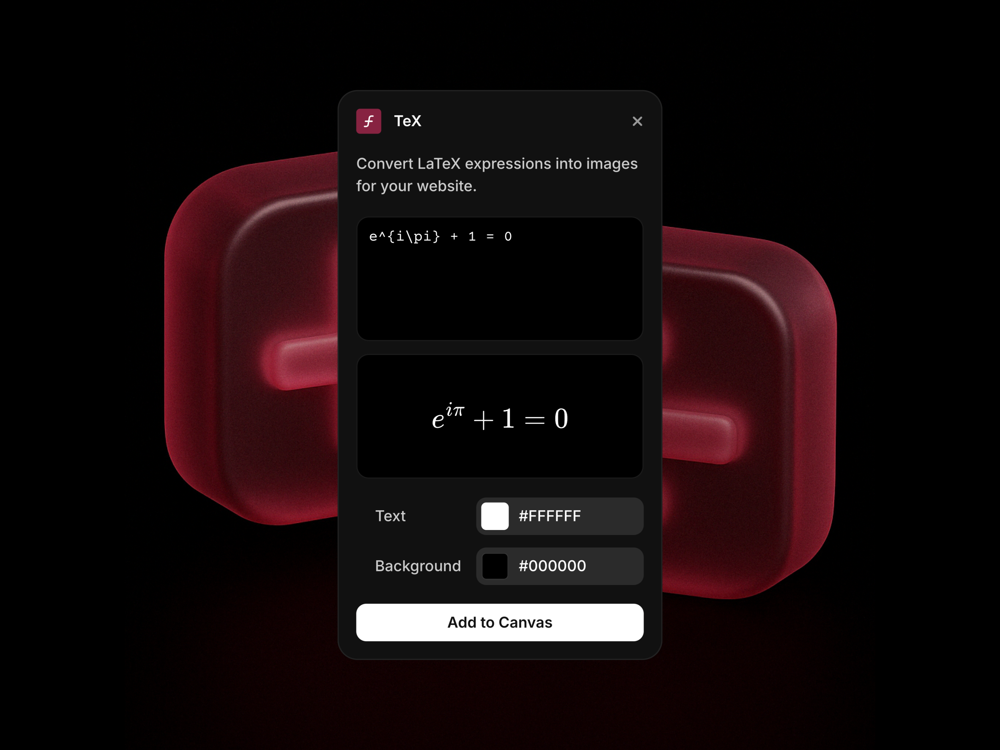

# TeX — Framer plugin

This plugin for Framer allows you to effortlessly convert LaTeX expressions into beautiful SVG images for your Framer projects. It transforms your typed LaTeX formulas into high-quality SVG graphics using MathJax, perfect for enhancing websites with mathematical expressions, equations, and technical content.

The plugin supports both canvas and image modes, making it accessible from the canvas editor as well as from Framer's image picker throughout your design workflow.



## Features

- Instantly render LaTeX expressions as high-quality SVG images using MathJax
- Customize text color and background color, including a transparent background
- Insert starter examples for fractions, matrices, sums, and aligned equations, with the chosen example kept selected
- Export self-contained SVGs with consistent padding and matching canvas dimensions
- See rendering errors in the preview and retry if the equation renderer fails to load
- Prevent stale previews and duplicate insertions while rendering or adding an equation
- Preview the rendered equation before adding it to the canvas
- **Canvas Mode**: Create frame elements with equation images directly on the canvas
- **Image Mode**: Use equations as image assets anywhere in Framer (image picker, CMS, localization)
- Seamlessly insert the final SVG image into your design with a single click

## Usage

The TeX plugin can be used in two different modes:

### Canvas Mode
1. Open the TeX plugin from the canvas in Framer
2. Type your LaTeX expression in the input field
   - Or choose a starter expression from the **Example** dropdown
3. Customize the appearance:
   - Adjust text color using the color picker
   - Change background color or click its clear icon to make it transparent
4. Preview your rendered equation
5. Click "Add to Canvas" to create a frame with the equation image

### Image Mode
1. Click on any image placeholder or use the image picker in Framer
2. Select "TeX" from the available plugins
3. Type your LaTeX expression in the input field
   - Or choose a starter expression from the **Example** dropdown
4. Customize the appearance with color options
5. Preview your rendered equation
6. Click "Use Equation" to set it as the selected image

The plugin automatically adapts its interface and behavior based on how it's launched, providing a seamless experience in both contexts.

### Examples and rendering

The **Example** dropdown sits below the preview, above the color controls. Choose a fraction, matrix, sum, or aligned equation to populate the input. The chosen example remains selected while the input matches it. Editing the expression shows **Custom equation**; choosing an example again replaces the input with that expression.

The preview and action button show **Rendering...** while the latest expression is being processed. Insertion is available only when that expression has a valid preview. Invalid LaTeX displays an error in the preview; edit the input to render again. If MathJax fails to load, click **Retry loading**. While insertion is in progress, the button shows **Adding...** and blocks duplicate clicks.

### Output sizing

Exported SVGs have a fixed width of 300px, with height calculated from the padded equation's aspect ratio. Canvas frames use the same dimensions as the exported SVG. Each SVG includes its own glyph definitions and, for a solid background, a background rectangle. Clearing the background color omits that rectangle for a transparent image.

Size and padding are currently fixed internally. Adjustable size and padding controls are planned for a follow-up update.

## File structure

- `src/App.tsx` — Main component that provides the UI and handles the rendering logic
- `src/App.css` — Styles for the plugin interface
- `src/ColorInput.tsx` — Component for color input functionality
- `src/mathjax.ts` — Shared renderer initialization and serialized LaTeX conversion
- `src/equation.ts` — Self-contained SVG export and image dimensions
- `src/examples.ts` — Starter LaTeX expressions
- `src/main.tsx` — Entry point for the plugin
- `tests/first-release.test.mjs` — Regression tests for rendering, SVG export, examples, and insertion behavior
- `public/` — Contains static assets and images
- `dist/` — Contains the built plugin files

## Development

To develop and extend the plugin:

1. Clone the repository
2. Install dependencies:
   ```bash
   npm install
   # or
   yarn install
   # or
   pnpm install
   ```
3. Start the development server:
   ```bash
   npm run dev
   # or
   yarn dev
   # or
   pnpm dev
   ```

The plugin uses:
- MathJax for LaTeX to SVG rendering
- TypeScript for type safety
- Vite for development and building
- ESLint for code quality

Run `npm run lint`, `npm run typecheck`, `npm test`, and `npm run build` before shipping.
The regression tests use real MathJax output in jsdom and mock the Framer host APIs;
canvas and image insertion should also be checked inside Framer.

## Requirements

- Framer
- Node.js and npm (for development purposes)

## Contributing

Feel free to contribute to this project! You can submit issues or pull requests to help improve the plugin.

## License

This project is licensed under the MIT License. See the `LICENSE` file for more information.
