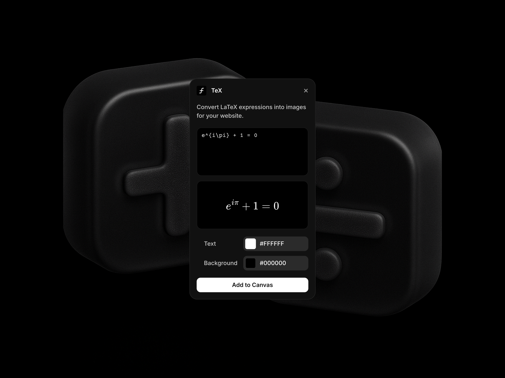

# TeX — Framer plugin

This plugin for Framer allows you to effortlessly convert LaTeX expressions into beautiful SVG images for your Framer projects. It transforms your typed LaTeX formulas into high-quality SVG graphics using MathJax, perfect for enhancing websites with mathematical expressions, equations, and technical content.



## Features

- Instantly render LaTeX expressions as high-quality SVG images using MathJax
- Customize text color, background color, and output resolution
- Preview the rendered equation before adding it to the canvas
- Seamlessly insert the final SVG image into your design with a single click

## Usage

1. Open the TeX plugin in Framer
2. Type your LaTeX expression in the input field
3. Customize the appearance:
   - Adjust text color using the color picker
   - Change background color or make it transparent
   - Select the desired output resolution
4. Preview your rendered equation
5. Click "Add to Canvas" to insert the image into your design

## File structure

- `src/App.tsx` — Main component that provides the UI and handles the rendering logic
- `src/App.css` — Styles for the plugin interface
- `src/ColorInput.tsx` — Component for color input functionality
- `src/main.tsx` — Entry point for the plugin
- `public/` — Contains static assets and images
- `dist/` — Contains the built plugin files

## Development

To develop and extend the plugin:

1. Clone the repository
2. Install dependencies:
   ```bash
   npm install
   # or
   yarn install
   # or
   pnpm install
   ```
3. Start the development server:
   ```bash
   npm run dev
   # or
   yarn dev
   # or
   pnpm dev
   ```

The plugin uses:
- MathJax for LaTeX to SVG rendering
- TypeScript for type safety
- Vite for development and building
- ESLint for code quality

## Requirements

- Framer
- Node.js and npm (for development purposes)

## Contributing

Feel free to contribute to this project! You can submit issues or pull requests to help improve the plugin.

## License

This project is licensed under the MIT License. See the `LICENSE` file for more information.
